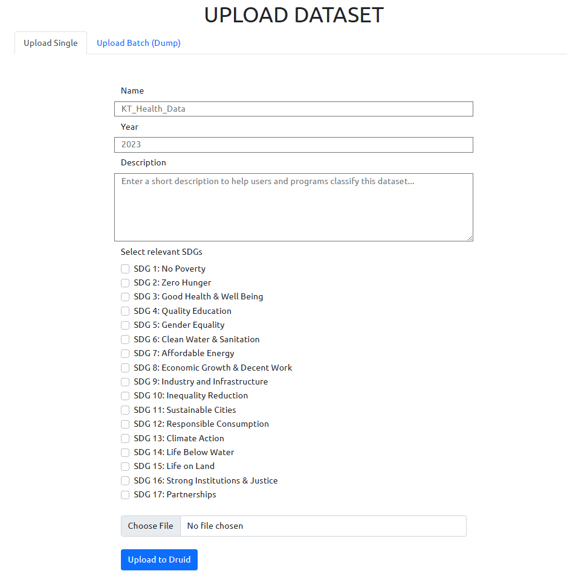
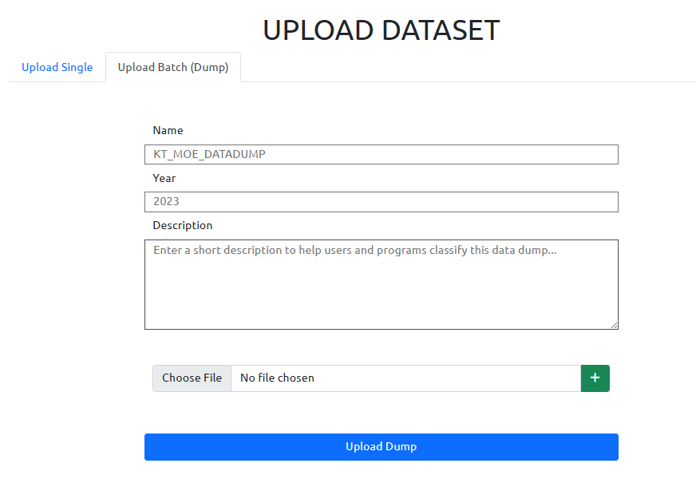

# Data Ingestion for Druid

Upload Form (CSV/XLSX, Single) | Upload Form (Batch)
---|---|
  |  |

This folder contains the following files and directories, 

| File Name | Purpose |
|---|---|
| `form-upload.php` | The page which contains an upload form that takes CSV/XLSX files, written in PHP, HTML and Bootstrap 5.|
| `upload-batch.php` | The backend code for batch (multiple file) upload. |
| `upload.php` | The backend code for single upload files. |
| `upload_single_druid.py` | The Python code for Druid ingestion (single file). |
| `upload_batch_druid.py` | The Python code to ingest a directory by going through CSV/XLSX files for a batch upload |
| `druid_lib.py` | Contains relevant functions to be used for Druid ingestion |
| `dataset-catalog.csv` | Contains metadata of the uploaded files. |
| `metadata_writer.py` | Used to write metadata to CSV. |
| `xlsx2csv.py` | Used to convert XLSX files to CSV. |
| `data-catalog.php` | Catalog to display datasets currently in Druid |
| `fetch.php` | The PHP page that calls `pydruid-fetch`, and shows a preview of the data. |
| `pydruid_fetch.py` | Used to fetch data from Druid. |
| `settings.py` | The settings (such as default Druid server and port location, along with the default datasets directory).  |
| `logger.py` | The logger used to log events and exceptions to a file. |
| `log.txt` | Default file for logging. |
| `clean.sh` | Script for emptying the metadata catalog, datasets directory and the log file. Used for testing purposes. |
| `styles/` | Contains CSS stylesheets used by the webpages |
| `datasets/` | Local storage for datasets uploaded. |

## Mechanism

First, the files are moved from _POST to the directory `datasets`. If it is a single file, the timestamp is appended to the file. If there is batch upload, a directory is created with the name `timestamp_[Name of Dump]` and all the files are transferred there.

Next, any XLSX files are converted to CSV. Finally, using `druid_lib.py` and the location of the Druid server from `settings.py`, JSON spec is created and the CSV files are then pushed to druid by creating a new task.

The metadata is appended to `dataset-catalog.csv`.

## Running

* Ensure you are on WSL / Ubuntu and have VS Code running.

* Download the PHP server extension for VS Code.

* Host `index.php` by right clicking in the code editor and selecting `Serve Webpage` to `http://localhost:3000` by default.

* Run Apache Druid on your machine, by default the Druid web server listens to `http://localhost:8888`, if not, modify the `settings.py` file.

* Upload a CSV file using the form and test!

## Form metadata

The form meta data is stored in the file `dataset-catalog.csv`. Most of the columns are self-explanatory barring the SDG one. The SDG data is stored as bitfield, with bits 0-17 representing SDG goals.

## TODO

- [X] Add SDG goals in the form. 

- [X] Sanity checks in the form.

- [X] Upload sheets of a single XLSX file

- [ ] Data cleaning before ingestion.

- [X] Implement XLSX/PDF formats.

- [ ] Send form meta data to Druid.

- [ ] Append taluka codes for district based data.

- [ ] Classification of dataset based on column labels.

- [X] Implement a metadata CSV file for easier access.

- [X] Implement a batch upload dump form.

- [ ] Integrate with SSH.

- [ ] Embed to WP.

- [X] Better error reporting.

- [X] Integrate with catalog.