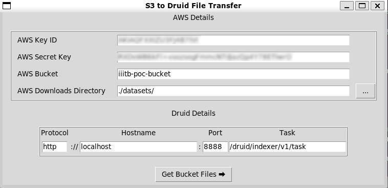
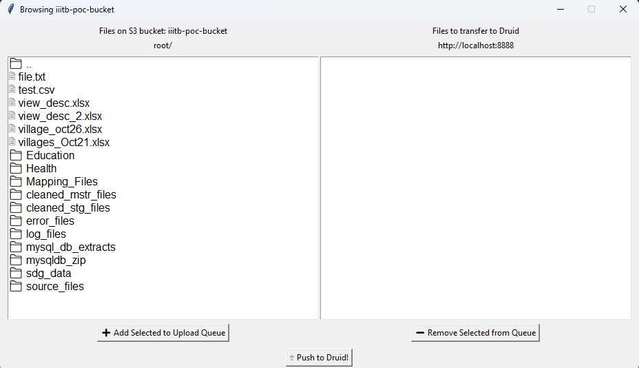

# S3 to Druid Ingestion

| Form | Browser |
| ---- | ------ |
||  |

This is a simple UI application to transfer files from S3 to Druid made using TkInter.

Enter your AWS key ID, AWS Secret Key, and bucket name. Enter your Druid server details and you'll be prompted to browse the bucket, select files and then push them to your Druid server directly.

Make sure to have `ttf-ancient-fonts` package installed if you're a Debian/Ubuntu user for correct rendering of Unicode!